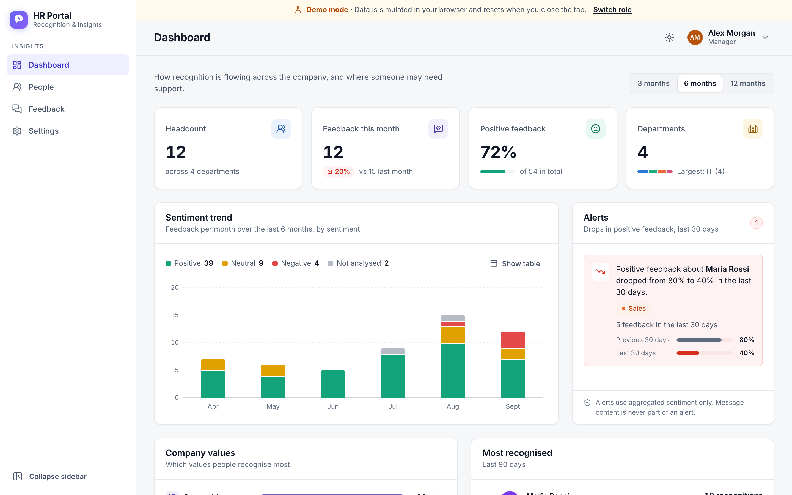
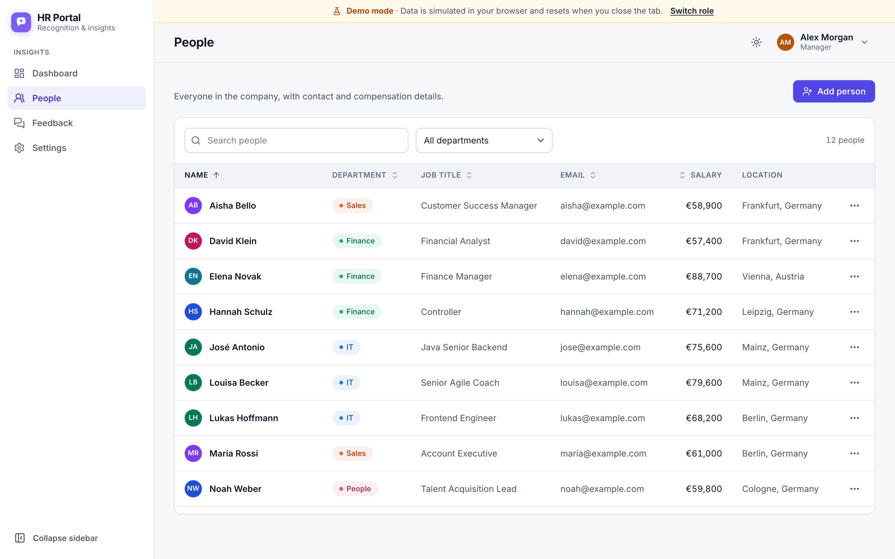
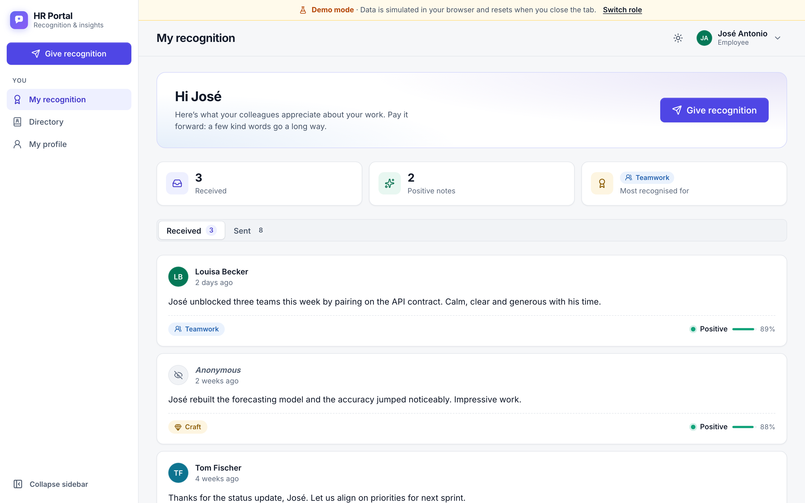
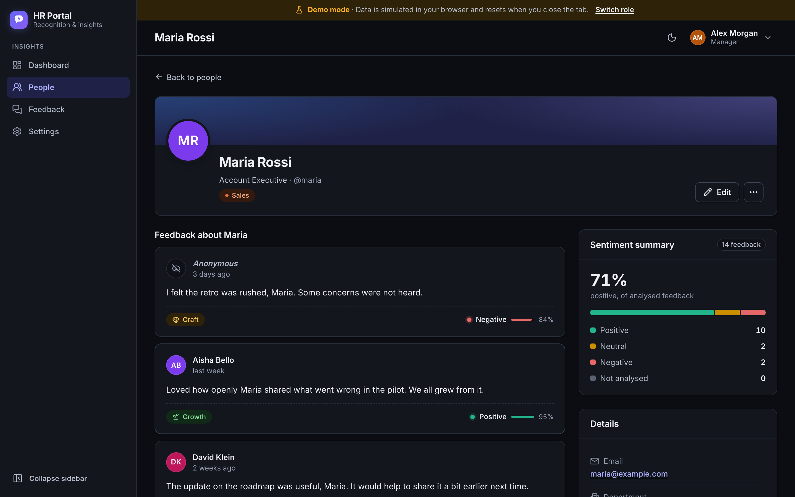
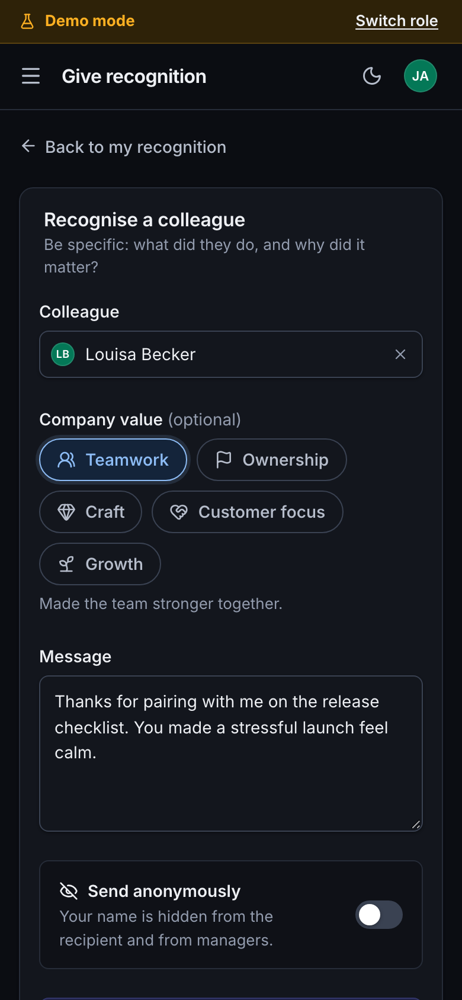

# HR Portal

[](https://jacidprogrammer.github.io/HRWebApp-UI/)
[](https://github.com/jacidProgrammer/HRWebApp-UI/actions/workflows/ci.yml)
[](https://github.com/jacidProgrammer/HRWebApp-UI/actions/workflows/pages.yml)
[](https://github.com/jacidProgrammer/HRWebApp-UI/actions/workflows/lighthouse.yml)
[](https://github.com/jacidProgrammer/HRWebApp-UI/actions/workflows/codeql.yml)
[](LICENSE)

**Peer recognition for everyone, with insights for managers.** Colleagues thank each other for specific work,
tagged with a company value. Managers see how recognition flows across the company: monthly sentiment trends,
which values show up most, who gets recognised, and an early alert when positive feedback about someone drops.

**[Try the live demo](https://jacidprogrammer.github.io/HRWebApp-UI/)**: no account, no backend, it runs in
your browser. Open it [as a manager](https://jacidprogrammer.github.io/HRWebApp-UI/dashboard?as=manager) or
[as an employee](https://jacidprogrammer.github.io/HRWebApp-UI/recognition?as=jose).



- **React 19 + TypeScript (strict)**, Vite, React Router 7, TanStack Query, Keycloak (PKCE), plain CSS with
  design tokens, English/Spanish/German.
- **Typed against the backend**: API types are generated from its OpenAPI document, and CI flags drift.
- **Tested**: Vitest + Testing Library, Playwright end-to-end, Lighthouse budgets, CodeQL.
- **Ships as one Docker image** configured at start-up, served by a hardened nginx (CSP, security headers,
  caching).

This is the frontend of [HRWebApp](https://github.com/jacidProgrammer/HRWebApp), a Spring Boot API secured
with Keycloak. To run the whole stack (database, Keycloak, API and this UI) with one command, see the
[backend README](https://github.com/jacidProgrammer/HRWebApp#readme).

**Design decisions** are recorded as ADRs in [`docs/adr/`](docs/adr/README.md): [TanStack Query](docs/adr/0001-tanstack-query-for-server-state.md),
[runtime config](docs/adr/0002-runtime-config-via-config-js.md), [demo mode with MSW](docs/adr/0003-demo-mode-with-msw.md),
[CSS tokens over a UI kit](docs/adr/0004-css-tokens-over-ui-kit.md), [i18n](docs/adr/0005-typed-i18n.md) and
[OpenAPI-generated types](docs/adr/0006-openapi-generated-types.md). Changes are listed in the [changelog](CHANGELOG.md).

## Contents

- [Screenshots](#screenshots) · [Features](#features) · [Stack](#stack) · [Architecture](#architecture)
- [Running it with the backend](#running-it-with-the-backend) · [Demo mode](#demo-mode) · [API types](#api-types)
- [Scripts](#scripts) · [Testing and CI](#testing-and-ci) · [Docker](#docker) · [Privacy](#privacy)

## Screenshots

| People directory (manager) | My recognition (employee) |
|---|---|
|  |  |

| Person page, dark theme | Give recognition on a phone |
|---|---|
|  |  |

## Features

### Employees (`EMPLOYEE`)

- **My recognition** (home). Shows the feedback you've received with its value tag, sentiment, date and author
  (or *Anonymous*), plus a **Sent** tab. There's a short summary on top: how much you've received, how many
  positive notes, and the value you're recognised for most.
- **Give recognition**:
  - pick the colleague in an accessible combobox (full keyboard support, live result count);
  - optionally tag a value: Teamwork, Ownership, Craft, Customer focus or Growth;
  - write the message: a character counter appears only near the 500-character limit;
  - choose whether to send it anonymously.

  A notice says, before you write, whether the message will be analysed by the AI model; it follows the
  organisation's setting. A live preview shows how the recipient will see it.
- **Directory**: a read-only list of colleagues. Salary and address are hidden, and the API doesn't return them anyway.
- **My profile**: update your email and address. Your salary, address and start date are shown only to you
  (and to managers).

### Managers (`MANAGER`)

- **Dashboard** (`GET /stats/overview`):
  - KPI cards: headcount, feedback this month with the change from last month, share of positive feedback, departments.
  - A stacked sentiment trend over 3, 6 or 12 months. It's an accessible SVG with a legend, a hover tooltip and a
    *Show table* fallback.
  - Value distribution and the five most recognised people.
  - An **alerts** panel that links to the person.
- **People**: a sortable table with a sticky header.
  - Search and department filters live in the URL, so a filtered view can be bookmarked or shared.
  - Clicking a row opens the person. The row menu has *Edit* and *Delete* (with confirmation).
  - You can also create people. Validation matches the backend: required fields, email format, salary > 0.
- **Person page**: details, a sentiment summary and the feedback about them, five at a time with *Show more*.
- **Feedback explorer** (`GET /feedback`): filter by department, person, sentiment and date range. Every
  filter is in the URL, and results come 20 at a time.
  - Dates are shown and typed in the app's language (`21/09/2026` in English and Spanish, `21.09.2026` in
    German), not the browser's. Type a date or pick it from a calendar that works with the keyboard (arrows,
    Page Up/Down, Home/End, Enter, Escape).
- **Settings**: turn AI sentiment analysis on or off (`PUT /settings`). The page also shows whether a model is
  configured and explains what the product guarantees about privacy.

### Everyone

- Light, dark and system themes (remembered), in English, Spanish and German. German uses *Sie*. The language is
  detected from the browser and can be switched in the user menu.
- A collapsible sidebar that becomes a drawer on phones. Works down to 360 px wide.
- Skeletons while loading, and empty and error states with a retry. Toasts confirm actions. Deletes and the AI
  toggle update immediately and roll back if the server refuses.
- Pages for another role show *Access denied*, and the API rejects those requests too.

## Stack

- React 19, TypeScript (strict), Vite, React Router 7
- TanStack Query 5 for server state, and Axios for HTTP (bearer token, `401` handling, error mapping)
- `keycloak-js` 26: authorization code flow with PKCE (S256)
- Plain CSS: a design-token file (`src/styles/tokens.css`) with light and dark themes, and one stylesheet per
  component. No Tailwind, no UI kit.
- Inter (variable, self-hosted via `@fontsource-variable`) with tabular numbers, and `lucide-react` icons
- Mock Service Worker for demo mode
- `openapi-typescript` for the API types, generated from the backend's OpenAPI document
- Vitest + Testing Library, Playwright, Lighthouse CI, ESLint (type-checked `typescript-eslint` rules)

## Architecture

```
src/
├── api/          Axios client, ApiError mapping, endpoint functions, query keys, TanStack Query hooks
│   └── generated/  OpenAPI document of the backend (pinned) and the types generated from it
├── app/          Providers and routes (manager pages are lazy-loaded)
├── auth/         Keycloak and demo-mode providers, useAuth, RequireRole
├── components/
│   ├── shell/    App shell: sidebar/drawer, top bar, theme and user menus, page titles
│   ├── ui/       Avatar, chips, sentiment indicator, dialog, menu, toast, tabs, fields, switch, combobox, …
│   └── charts/   Sentiment trend chart and its (unit-tested) data transform
├── features/     One folder per area: dashboard, people, recognition, feedback, profile, settings, system
├── i18n/         Typed dictionaries (en is the source of truth), plural rules, provider
├── lib/          Formatting (Intl), locale-aware dates, validation that mirrors the backend, colour hashing
├── mocks/        Demo mode: seeded data, MSW handlers implementing the API contract, stats computation
├── styles/       tokens.css and base.css
└── theme/        Theme provider (light / dark / system)
```

- **Server state** lives in TanStack Query. Each resource has its own query keys (`employees`, `feedback`,
  `stats`, `settings`). Mutations invalidate by prefix, so every cached list of a resource refreshes. The client
  never retries a `4xx`, and retries network errors and `5xx` at most twice.
- **Errors**: every failure becomes an `ApiError` with a kind (`BAD_REQUEST`, `FORBIDDEN`, `NOT_FOUND`,
  `CONFLICT`, `SERVER`, `NETWORK`, …). The UI localises it and prefers the backend's own message when it sends one.
- **Identity**: URLs use the employee `id`. "Is this me?" compares the token's `preferred_username` with the
  employee `username`, case-insensitively. Employees load their own record from `GET /employees/me`.
- **Runtime config**: `index.html` loads `/config.js`, which sets `window.__APP_CONFIG__`. In Docker it is written
  at container start (see below). In development it is empty and the `VITE_*` variables apply. That way one image
  runs in any environment.
- **Base path**: the app works under a sub-path. The router basename, the service worker's URL and scope, the mock
  API, `config.js`, assets and fonts all follow Vite's `base` (`/HRWebApp-UI/` for GitHub Pages).

## Running it with the backend

You need Node.js 22.12+, Docker and a clone of the backend.

1. **Start Keycloak 26 and the databases** from the backend repository:

   ```bash
   git clone https://github.com/jacidProgrammer/HRWebApp.git
   cd HRWebApp
   docker compose up -d
   ```

   Keycloak runs on `http://localhost:8082` and imports the `hr-realm` realm. That realm has the public
   client `hr-api-login`, which allows redirects to `http://localhost:5173`. If you ran an older version of the
   stack, run `docker compose down -v` once, so the new realm is imported.

2. **Start the API** on `http://localhost:8080` (JDK 21), still in the backend repository:

   ```bash
   ./mvnw spring-boot:run                                        # in-memory H2 with demo data
   ./mvnw spring-boot:run -Dspring-boot.run.profiles=postgres    # or PostgreSQL
   ```

   Set `HUGGINGFACE_TOKEN` to enable sentiment analysis. Without it, feedback is saved and shows as *Not analysed*.

3. **Start the UI** in this repository:

   ```bash
   cp .env.example .env   # optional: the defaults match the setup above
   npm install
   npm run dev
   ```

   Open <http://localhost:5173> and sign in. The dev server is pinned to port 5173, because that origin is
   registered in Keycloak and in the backend's CORS settings.

**Demo users** (from the backend's realm export, *for local use only*). The password is `1234` for all of them.

| User      | Role       | Try                                                              |
|-----------|------------|------------------------------------------------------------------|
| `manager` | `MANAGER`  | Dashboard, people, feedback explorer, settings                   |
| `jose`    | `EMPLOYEE` | Give and receive recognition, edit your profile                  |
| `louisa`, `maria`, `lukas` | `EMPLOYEE` | The same, from other points of view                 |

### Configuration

| Build-time (dev)          | Runtime (Docker)     | Default                 |
|---------------------------|----------------------|-------------------------|
| `VITE_API_BASE_URL`       | `API_BASE_URL`       | `http://localhost:8080` |
| `VITE_KEYCLOAK_URL`       | `KEYCLOAK_URL`       | `http://localhost:8082` |
| `VITE_KEYCLOAK_REALM`     | `KEYCLOAK_REALM`     | `hr-realm`              |
| `VITE_KEYCLOAK_CLIENT_ID` | `KEYCLOAK_CLIENT_ID` | `hr-api-login`          |
| `VITE_AUTH_MODE`          | `AUTH_MODE`          | `keycloak` (or `mock`)  |
| –                         | `ENABLE_HSTS`        | `false`                 |

Runtime values win over build-time ones.

## Demo mode

```bash
npm install
npm run dev:mock        # http://localhost:5173
```

Demo mode swaps Keycloak for a role picker and serves the API from the browser with
[Mock Service Worker](https://mswjs.io). The fake API implements the same contract as the backend, including
role checks, validation errors and the `409` for a duplicate username.

- The seed data is 12 employees in four departments, about 50 feedback items spread over six months, and one alert.
- Changes last until you close the tab (they're kept in `sessionStorage`).
- A **Demo mode** banner is always visible.
- Sentiment for new messages comes from a simple keyword heuristic, not the real model.

Add `?as=manager` or `?as=jose` (any demo user) to a URL to skip the role picker, as the links at the top do.

The [live demo](https://jacidprogrammer.github.io/HRWebApp-UI/) is this mode, built for the `/HRWebApp-UI/` sub-path
and deployed to GitHub Pages by `.github/workflows/pages.yml` on every push to `main`. Pages has no rewrites, so
the build also writes `404.html` as a copy of the app shell: a deep link or a reload on `/HRWebApp-UI/people/<id>`
boots the app with the URL intact. To try that build locally: `npm run build:pages && npm run preview:pages`,
then open <http://localhost:4190/HRWebApp-UI/>.

Demo mode is never on by default: it needs `--mode mock`, `VITE_AUTH_MODE=mock` or the runtime `AUTH_MODE=mock`.
If a browser refuses to register the service worker (some private modes and embedded webviews), the same handlers
answer inside the page instead.

## API types

The types in `src/api/types.ts` are derived from the backend's OpenAPI document, so a renamed or retyped field
in the backend becomes a compile error here ([ADR 0006](docs/adr/0006-openapi-generated-types.md)).

```bash
npm run api:types                                  # from the backend's main branch (docs/openapi.json)
npm run api:types -- ../HRWebApp/docs/openapi.json # from a local file, or any URL
OPENAPI_SPEC=http://localhost:8080/v3/api-docs npm run api:types
npm run api:types -- --pinned                      # offline, from the committed copy
```

It writes `src/api/generated/openapi.json` (the document used, without `servers`) and
`src/api/generated/schema.d.ts`; commit both, so builds never need the network. `types.ts` gives the generated
schemas the app's names, and narrows a request body only where the app is stricter than the contract.

CI checks the committed types twice: against the pinned document (build job) and against the backend's current
document on `main` (`api-contract` job, `npm run api:check`). If the backend changed, the job fails with the
lines that differ: run `npm run api:types`, fix the type errors, and commit. If the document can't be found
(the URL answers 404, as before the backend first published it), the job warns and passes.

## Scripts

| Command                    | What it does                                                   |
|----------------------------|----------------------------------------------------------------|
| `npm run dev`              | Dev server on <http://localhost:5173> against the real backend |
| `npm run dev:mock`         | Dev server in demo mode                                        |
| `npm run build`            | Type-check and production build (`dist/`)                      |
| `npm run build:mock`       | Demo-mode build (`dist-mock/`), used by the e2e tests          |
| `npm run build:pages`      | Demo-mode build for GitHub Pages under `/HRWebApp-UI/` (`dist-pages/`) |
| `npm run preview`          | Serve `dist/`                                                  |
| `npm run preview:mock`     | Serve `dist-mock/` on port 4180                                |
| `npm run preview:pages`    | Serve `dist-pages/` like GitHub Pages, on <http://localhost:4190/HRWebApp-UI/> |
| `npm run lint`             | ESLint                                                         |
| `npm run typecheck`        | TypeScript only                                                |
| `npm run api:types`        | Regenerate the API types from the backend's OpenAPI document   |
| `npm run api:check`        | Fail if the committed API types differ from the backend's      |
| `npm test`                 | Unit and component tests (Vitest)                              |
| `npm run test:e2e`         | Playwright end-to-end tests in demo mode                       |
| `npm run docs:screenshots` | Regenerate the README screenshots (needs `preview:mock` running) |

## Testing and CI

- **Unit and component tests** (Vitest, jsdom) sit next to the code. They cover:
  - the API client and error mapping, the retry policy, and the query and mutation hooks (optimistic updates and
    rollbacks), run against the demo-mode handlers;
  - the types derived from the OpenAPI document (type-level tests);
  - combobox and date picker keyboard behaviour, date parsing and formatting per locale, the chart data
    transform, i18n (key and placeholder parity across languages, fallback, formal German) and `RequireRole`;
  - validation, formatting, runtime configuration and base paths;
  - the give-recognition, people, settings and profile pages, and the demo sign-in.
- **End-to-end tests** (Playwright, Chromium) run against the demo-mode build.
  - Manager: dashboard KPIs, chart and alert; sorting and filtering people through the URL; creating, editing and
    deleting a person; the AI toggle; date filters typed, validated and picked in the app's language (in a
    browser set to `en-US`); feedback about a person, five at a time.
  - Employee: giving anonymous recognition and finding it under *Sent*; received recognition; editing the profile;
    being blocked from manager pages.

  Install the browser once with `npx playwright install chromium`.

GitHub Actions:

| Workflow | What it does |
|---|---|
| [`ci.yml`](.github/workflows/ci.yml) | Lint, type-check, generated types vs pinned spec, unit tests, build and Pages build; e2e; `api-contract` against the backend; Docker image build (not pushed) with a smoke test of the headers |
| [`pages.yml`](.github/workflows/pages.yml) | Builds the demo for `/HRWebApp-UI/` and deploys it to GitHub Pages |
| [`lighthouse.yml`](.github/workflows/lighthouse.yml) | Lighthouse CI on the demo build ([`lighthouserc.json`](lighthouserc.json)), simulated mobile: fails under 0.85 performance, 0.95 accessibility or 0.9 best practices |
| [`codeql.yml`](.github/workflows/codeql.yml) | CodeQL (`security-and-quality`) for JavaScript/TypeScript, on pushes, PRs and weekly |

Dependabot ([`dependabot.yml`](.github/dependabot.yml)) opens weekly, grouped updates for npm (production and
development), GitHub Actions and the Docker base images.

## Docker

```bash
docker build -t hr-portal .
docker run --rm -p 5173:80 hr-portal
```

The image is built once and configured at startup.

- An nginx entrypoint script (`docker/40-app-config.sh`) writes `/config.js` from the runtime variables in the
  table above, and the Content-Security-Policy from the same values.
- nginx serves the SPA with a fallback to `index.html`.
- Publish the container on port 5173 to reuse the realm's redirect URI. For any other origin, add it to the
  Keycloak client and to the backend's `CORS_ALLOWED_ORIGINS`.

For example:

```bash
docker run --rm -p 8088:80 \
  -e API_BASE_URL=https://api.example.com \
  -e KEYCLOAK_URL=https://auth.example.com \
  -e ENABLE_HSTS=true \
  hr-portal

docker run --rm -p 8089:80 -e AUTH_MODE=mock hr-portal   # a self-contained demo
```

### Security headers and caching

Configured in [`docker/nginx/`](docker/nginx/), on every response:

| Header | Value |
|---|---|
| `Content-Security-Policy` | `default-src 'self'`; scripts, styles and fonts from the app's origin only; `connect-src` limited to the app, `API_BASE_URL` and `KEYCLOAK_URL` origins (only `'self'` in demo mode); `frame-src 'none'`, `object-src 'none'`, `frame-ancestors 'none'`, `base-uri 'self'`, `form-action` self and Keycloak |
| `X-Content-Type-Options` | `nosniff` |
| `Referrer-Policy` | `strict-origin-when-cross-origin` |
| `Permissions-Policy` | camera, microphone, geolocation, payment, USB and motion sensors disabled |
| `X-Frame-Options` | `DENY` (with `frame-ancestors 'none'`) |
| `Cross-Origin-Opener-Policy` | `same-origin` |
| `Strict-Transport-Security` | Only with `ENABLE_HSTS=true`. Enable it only when users reach the site over HTTPS (TLS terminated by a proxy in front of the container): browsers remember it for a year. |

keycloak-js is initialised without the login-status iframe and without silent check-SSO, so no frame is ever
needed; enabling either would need `frame-src` for the Keycloak origin. The theme script lives in
`theme-init.js`, not inline, so `script-src 'self'` holds.

Hashed files under `/assets/` are cached for a year (`immutable`); `index.html`, `config.js`, the theme script,
the service worker and the favicon are revalidated on every load (`no-cache`). Text responses are gzipped.

## Privacy

- Feedback can be anonymous. The API never returns the author of anonymous feedback, not even to managers.
- Salary and address are only visible to managers and to the employee themselves.
- Authors are told before they write whether their message will be analysed by the AI model, and managers can turn
  the analysis off for the whole organisation.
- Alerts are built from aggregated sentiment only, never from message content.

The backend README covers the details, including what deleting a person removes and the GDPR considerations:
[HRWebApp › Privacy and GDPR](https://github.com/jacidProgrammer/HRWebApp#privacy-and-gdpr).

## License

[MIT](LICENSE)
