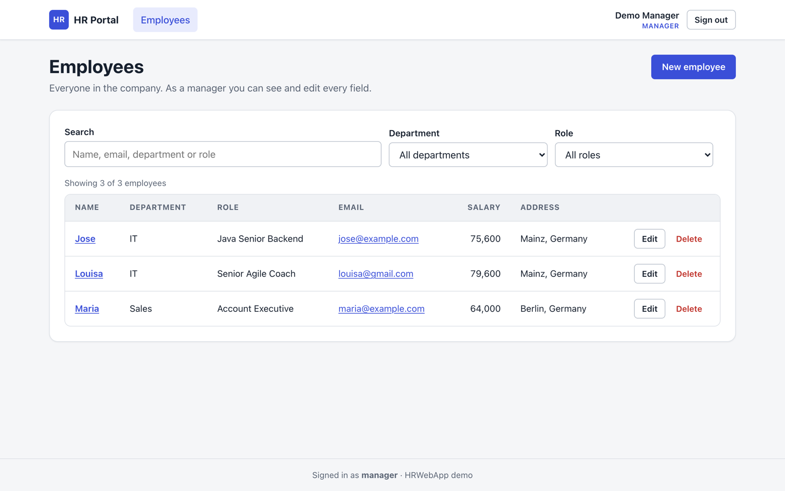
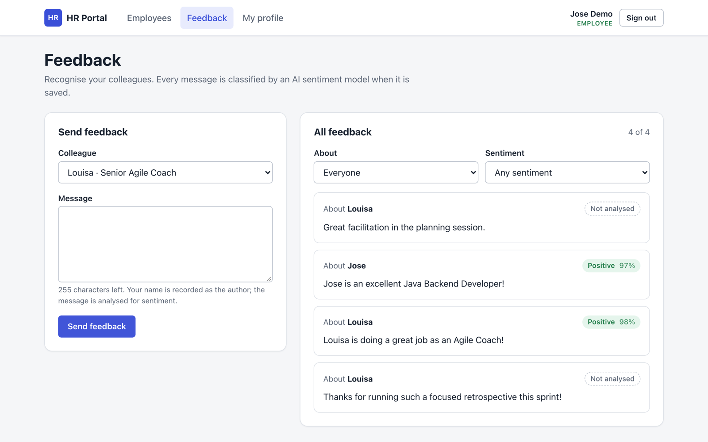

# HRWebApp UI

[](https://github.com/jacidProgrammer/HRWebApp-UI/actions/workflows/ci.yml)

React + TypeScript single-page app for [HRWebApp](https://github.com/jacidProgrammer/HRWebApp), a Spring Boot
HR backend. You sign in with Keycloak, and the UI shows only what your realm role (`MANAGER` or `EMPLOYEE`) can do:
an employee directory, profile editing and peer feedback with AI sentiment scores.

| Manager: employee directory | Employee: peer feedback with sentiment |
|---|---|
|  |  |

## Features

**Everyone who signs in**

- Keycloak sign-in with the authorization code flow and PKCE (S256) via `keycloak-js`. The token is refreshed before
  every API call, a `401` from the API starts a new sign-in, and **Sign out** ends the Keycloak session.
- Employee directory: a semantic table with client-side search and filters by department and role.
- Employee detail page.
- Loading, empty and error states on every screen. Backend errors (`400`/`403`/`404`/`409`) appear inline, using
  the backend's own message where it has one.

**`MANAGER`**

- Sees every field of every employee, including salary and address.
- Creates, edits (all fields except the name, which identifies the employee) and deletes employees. Deleting
  asks for confirmation in an accessible modal dialog.
- If the name is taken, the `409` shows next to the name field. Required fields are checked before submitting,
  using the same rules as the backend.

**`EMPLOYEE`**

- Sees colleagues without their salary and address. Those cells show as *Restricted*, because the API doesn't
  return them. The employee's own row is highlighted.
- **My profile**: edit your own email and address. That's all the backend allows. The record is matched on the
  token's `preferred_username`, case-insensitively, as the backend does.
- **Feedback**: list all feedback with a sentiment badge showing label and confidence. Feedback without a
  sentiment shows as *Not analysed*. Filter by colleague or sentiment, and send feedback about a colleague.

Controls you can't use aren't shown. If you open a page for another role by its URL, you get an *Access denied*
page, and the API rejects the request anyway.

## Stack

- React 19, TypeScript (strict), Vite, React Router
- Axios with interceptors for the bearer token, `401` handling and error mapping
- `keycloak-js` 22, the same major version as the Keycloak server in the backend's `docker-compose.yml`
- Plain CSS: one stylesheet built on CSS custom properties, with light and dark themes via `prefers-color-scheme`.
  No UI framework.
- Vitest, Testing Library and jsdom
- ESLint (flat config, `typescript-eslint` type-checked rules, React Hooks rules)
- GitHub Actions CI, and a multi-stage Dockerfile (nginx with SPA fallback)

## Running it with the backend

You need Node.js 22.12+ (or the current LTS), Docker and a clone of the backend.

1. **Start Keycloak and PostgreSQL** from the backend repository:

   ```bash
   git clone https://github.com/jacidProgrammer/HRWebApp.git
   cd HRWebApp
   docker compose up -d
   ```

   Keycloak runs on `http://localhost:8082` and imports the `hr-realm` realm. That realm includes the public
   client `hr-api-login`, which allows redirects to `http://localhost:5173`.

   > If you ran an older version of the backend's compose stack before, Keycloak keeps the old realm in its
   > database and skips the import. Run `docker compose down -v` once to re-import it.

2. **Start the backend** on `http://localhost:8080` (JDK 21), still in the backend repository:

   ```bash
   ./mvnw spring-boot:run                                        # in-memory H2, seeded on every start
   ./mvnw spring-boot:run -Dspring-boot.run.profiles=postgres    # or the persistent PostgreSQL database
   ```

   The backend allows CORS from `http://localhost:5173` by default. See `CORS_ALLOWED_ORIGINS` in its README.

3. **Start the UI** in this repository:

   ```bash
   cp .env.example .env   # optional: the defaults already match the setup above
   npm install
   npm run dev
   ```

   Open <http://localhost:5173>. You're redirected to the Keycloak login page.

### Demo users

These are defined in the backend's `realm-export/hr-realm.json`. They're **demo credentials for local use only**.

| User      | Password | Realm role | Employee record          | What you can try                                   |
|-----------|----------|------------|--------------------------|----------------------------------------------------|
| `manager` | `1234`   | `MANAGER`  | none                     | Create, edit and delete employees; see all salaries |
| `Jose`    | `1234`   | `EMPLOYEE` | `Jose` (seed data)       | Edit your own email/address, send and read feedback |
| `Louisa`  | `1234`   | `EMPLOYEE` | `Louisa` (seed data)     | Same as Jose, from the other side                  |

Sentiment analysis runs in the backend and needs a Hugging Face token (`HUGGINGFACE_TOKEN`). Without one,
feedback is still saved and shows as *Not analysed*.

### Configuration

| Variable                  | Default                  | Description                                 |
|---------------------------|--------------------------|---------------------------------------------|
| `VITE_API_BASE_URL`       | `http://localhost:8080`  | HRWebApp API base URL                       |
| `VITE_KEYCLOAK_URL`       | `http://localhost:8082`  | Keycloak server URL                         |
| `VITE_KEYCLOAK_REALM`     | `hr-realm`               | Realm imported by the backend               |
| `VITE_KEYCLOAK_CLIENT_ID` | `hr-api-login`           | Public OIDC client used for the login       |

The values are compiled into the bundle at build time. The dev server is pinned to port `5173` (`strictPort`),
because Keycloak's redirect URIs and the backend's CORS configuration are registered for that origin.

### Docker

```bash
docker build -t hrwebapp-ui .
docker run --rm -p 5173:80 hrwebapp-ui
```

The image serves the production build with nginx and falls back to `index.html` for client-side routes. Publish it
on port `5173` to reuse the realm's redirect URI. For any other origin, pass the `VITE_*` values as `--build-arg`,
add the origin to the Keycloak client and set the backend's `CORS_ALLOWED_ORIGINS`.

## Scripts

| Command              | What it does                                   |
|----------------------|------------------------------------------------|
| `npm run dev`        | Vite dev server on <http://localhost:5173>     |
| `npm run build`      | Type-check (`tsc -b`) and production build     |
| `npm run preview`    | Serve the production build locally             |
| `npm run lint`       | ESLint                                         |
| `npm run typecheck`  | TypeScript only                                |
| `npm test`           | Unit and component tests (Vitest, single run)  |
| `npm run test:watch` | Tests in watch mode                            |

CI (`.github/workflows/ci.yml`) runs `npm ci`, lint, tests and build on Node LTS for every push and pull request
to `main`.

## Project structure

```
src/
├── api/          Axios client (bearer token, 401 handling), error mapping, typed clients per resource,
│                 and types mirroring the backend DTOs
├── auth/         Keycloak setup, AuthProvider/useAuth, user and role parsing, RequireRole guard
├── components/   Layout, forms and fields, confirm dialog, sentiment badge, loading/empty/error states
├── hooks/        useAsync (loading/success/error with reload), useEmployees, useDocumentTitle
├── lib/          Validation rules mirroring the backend, formatting helpers
├── pages/        Employees, detail, create, edit, my profile, feedback, not found
├── styles/       global.css: design tokens, light/dark theme, components
└── test/         Test setup and render helpers (mocked auth context and fixtures)
```

Tests sit next to the code they cover (`*.test.ts[x]`). They cover the API error mapping and the HTTP interceptors,
the role guard, token parsing, validation, the sentiment badge, and the employees, create, profile and feedback
pages, with the API modules mocked.

## License

[MIT](LICENSE)
